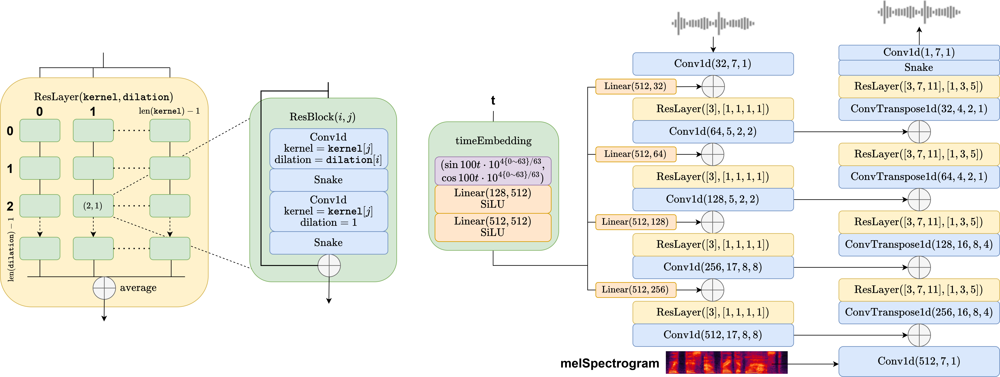

In this work, we introduce WaveODE, a reparameterized rectified flow model for mel-spectrogram conditioned speech synthesis. Since mel-spectrograms capture the energy distribution of waveforms, WaveODE employs a mel-conditioned prior distribution, rather than a standard Gaussian prior, to reduce unnecessary transportation costs during generation. Furthermore, while previous diffusion vocoders primarily optimize using a single loss function, we argue that incorporating auxiliary losses can enhance the quality of the generated samples in the context of WaveODE. To further accelerate the inference process without compromising sample quality, we propose a specialized consistency distillation method for WaveODE. Experimental results demonstrate that our model achieves superior performance in both quality and efficiency compared to previous diffusion vocoders, while enabling waveform generation in a single inference step.

# Model

The total amount of parameters is `19.5M`. The 128-dim time embedding is expanded to 512-dim after two linear-SiLU layers, and is then reshaped to the desired shape of each resolution. `Conv1d` and `ConvTranspose1d` are set with parameters `(output channel, kernel width, dilation, padding)`. In ResBlock `Conv1d` takes same padding. Each ResLayer is defined with a kernel list and a dilation list, and their cross-product of define the shape of the ResBlock matrix and the convolutional layers of each ResBlock. On the left column are downsampling ResLayers, each containing a `4 x 1` ResBlock matrix, while on the right columns are upsampling ResLayers, each containing a `3 x 3` ResBlock matrix, following the structure from HifiGAN. In each ResBlock the number of channels is unchanged.

For detailed parameter settings please refer to `WaveODE/src/params.py`.

# Audio Samples

<table>
  <thead>
    <tr>
      <td align="center"><b>Groundtruth</b> 
      </td>
      <td align="center"><b>WaveODE 6 step</b> 
      </td>
      <td align="center"><b>WaveODE 1 step</b> 
      </td>
      <td align="center"><b>Hifi-GAN V1 1 step</b> 
      </td>
      <td align="center"><b>Diffwave 6 steps</b> 
      </td>
      <td align="center"><b>PriorGrad 6 steps</b> 
      </td>
      <td align="center"><b>FreGrad 6 steps</b> 
      </td>
      <td align="center"><b>FastDiff 6 steps</b> 
      </td>
    </tr>
  </thead>
  <tbody>
    <tr><td colspan="8">Male 1</td></tr>
  </tbody>
  <tbody>
    <tr>
      <td align="center">
        <audio id="player" controls="" style="width:100px;" preload="auto"><source src="audio/GT/1089_134686_000007_000005.wav"></audio>
      </td>
      <td align="center">
        <audio id="player" controls="" style="width:100px;" preload="auto"><source src="audio/WaveODE6/1089_134686_000007_000005.wav"></audio>
      </td>
      <td align="center">
        <audio id="player" controls="" style="width:100px;" preload="auto"><source src="audio/WaveODE1/1089_134686_000007_000005.wav"></audio>
      </td>
      <td align="center">
        <audio id="player" controls="" style="width:100px;" preload="auto"><source src="audio/HifiGAN/1089_134686_000007_000005.wav"></audio>
      </td>
      <td align="center">
        <audio id="player" controls="" style="width:100px;" preload="auto"><source src="audio/DiffWave/1089_134686_000007_000005.wav"></audio>
      </td>
      <td align="center">
        <audio id="player" controls="" style="width:100px;" preload="auto"><source src="audio/PriorGrad/1089_134686_000007_000005.wav"></audio>
      </td><td align="center">
        <audio id="player" controls="" style="width:100px;" preload="auto"><source src="audio/FreGrad/1089_134686_000007_000005.wav"></audio>
      </td><td align="center">
        <audio id="player" controls="" style="width:100px;" preload="auto"><source src="audio/FastDiff/1089_134686_000007_000005.wav"></audio>
      </td>
    </tr>
  </tbody>
  <tbody>
    <tr><td colspan="8">Male 2</td></tr>
  </tbody>
  <tbody>
    <tr>
      <td align="center">
        <audio id="player" controls="" style="width:100px;" preload="auto"><source src="audio/GT/1089_134686_000024_000007.wav"></audio>
      </td>
      <td align="center">
        <audio id="player" controls="" style="width:100px;" preload="auto"><source src="audio/WaveODE6/1089_134686_000024_000007.wav"></audio>
      </td>
      <td align="center">
        <audio id="player" controls="" style="width:100px;" preload="auto"><source src="audio/WaveODE1/1089_134686_000024_000007.wav"></audio>
      </td>
      <td align="center">
        <audio id="player" controls="" style="width:100px;" preload="auto"><source src="audio/HifiGAN/1089_134686_000024_000007.wav"></audio>
      </td>
      <td align="center">
        <audio id="player" controls="" style="width:100px;" preload="auto"><source src="audio/DiffWave/1089_134686_000024_000007.wav"></audio>
      </td>
      <td align="center">
        <audio id="player" controls="" style="width:100px;" preload="auto"><source src="audio/PriorGrad/1089_134686_000024_000007.wav"></audio>
      </td><td align="center">
        <audio id="player" controls="" style="width:100px;" preload="auto"><source src="audio/FreGrad/1089_134686_000024_000007.wav"></audio>
      </td><td align="center">
        <audio id="player" controls="" style="width:100px;" preload="auto"><source src="audio/FastDiff/1089_134686_000024_000007.wav"></audio>
      </td>
    </tr>
  </tbody>
  <tbody>
    <tr><td colspan="8">Male 3</td></tr>
  </tbody>
  <tbody>
    <tr>
      <td align="center">
        <audio id="player" controls="" style="width:100px;" preload="auto"><source src="audio/GT/1188_133604_000011_000003.wav"></audio>
      </td>
      <td align="center">
        <audio id="player" controls="" style="width:100px;" preload="auto"><source src="audio/WaveODE6/1188_133604_000011_000003.wav"></audio>
      </td>
      <td align="center">
        <audio id="player" controls="" style="width:100px;" preload="auto"><source src="audio/WaveODE1/1188_133604_000011_000003.wav"></audio>
      </td>
      <td align="center">
        <audio id="player" controls="" style="width:100px;" preload="auto"><source src="audio/HifiGAN/1188_133604_000011_000003.wav"></audio>
      </td>
      <td align="center">
        <audio id="player" controls="" style="width:100px;" preload="auto"><source src="audio/DiffWave/1188_133604_000011_000003.wav"></audio>
      </td>
      <td align="center">
        <audio id="player" controls="" style="width:100px;" preload="auto"><source src="audio/PriorGrad/1188_133604_000011_000003.wav"></audio>
      </td><td align="center">
        <audio id="player" controls="" style="width:100px;" preload="auto"><source src="audio/FreGrad/1188_133604_000011_000003.wav"></audio>
      </td><td align="center">
        <audio id="player" controls="" style="width:100px;" preload="auto"><source src="audio/FastDiff/1188_133604_000011_000003.wav"></audio>
      </td>
    </tr>
  </tbody>
  <tbody>
    <tr><td colspan="8">Male 4</td></tr>
  </tbody>
  <tbody>
    <tr>
      <td align="center">
        <audio id="player" controls="" style="width:100px;" preload="auto"><source src="audio/GT/1188_133604_000018_000000.wav"></audio>
      </td>
      <td align="center">
        <audio id="player" controls="" style="width:100px;" preload="auto"><source src="audio/WaveODE6/1188_133604_000018_000000.wav"></audio>
      </td>
      <td align="center">
        <audio id="player" controls="" style="width:100px;" preload="auto"><source src="audio/WaveODE1/1188_133604_000018_000000.wav"></audio>
      </td>
      <td align="center">
        <audio id="player" controls="" style="width:100px;" preload="auto"><source src="audio/HifiGAN/1188_133604_000018_000000.wav"></audio>
      </td>
      <td align="center">
        <audio id="player" controls="" style="width:100px;" preload="auto"><source src="audio/DiffWave/1188_133604_000018_000000.wav"></audio>
      </td>
      <td align="center">
        <audio id="player" controls="" style="width:100px;" preload="auto"><source src="audio/PriorGrad/1188_133604_000018_000000.wav"></audio>
      </td><td align="center">
        <audio id="player" controls="" style="width:100px;" preload="auto"><source src="audio/FreGrad/1188_133604_000018_000000.wav"></audio>
      </td><td align="center">
        <audio id="player" controls="" style="width:100px;" preload="auto"><source src="audio/FastDiff/1188_133604_000018_000000.wav"></audio>
      </td>
    </tr>
  </tbody>
  <tbody>
    <tr><td colspan="8">Male 5</td></tr>
  </tbody>
  <tbody>
    <tr>
      <td align="center">
        <audio id="player" controls="" style="width:100px;" preload="auto"><source src="audio/GT/1320_122612_000013_000000.wav"></audio>
      </td>
      <td align="center">
        <audio id="player" controls="" style="width:100px;" preload="auto"><source src="audio/WaveODE6/1320_122612_000013_000000.wav"></audio>
      </td>
      <td align="center">
        <audio id="player" controls="" style="width:100px;" preload="auto"><source src="audio/WaveODE1/1320_122612_000013_000000.wav"></audio>
      </td>
      <td align="center">
        <audio id="player" controls="" style="width:100px;" preload="auto"><source src="audio/HifiGAN/1320_122612_000013_000000.wav"></audio>
      </td>
      <td align="center">
        <audio id="player" controls="" style="width:100px;" preload="auto"><source src="audio/DiffWave/1320_122612_000013_000000.wav"></audio>
      </td>
      <td align="center">
        <audio id="player" controls="" style="width:100px;" preload="auto"><source src="audio/PriorGrad/1320_122612_000013_000000.wav"></audio>
      </td><td align="center">
        <audio id="player" controls="" style="width:100px;" preload="auto"><source src="audio/FreGrad/1320_122612_000013_000000.wav"></audio>
      </td><td align="center">
        <audio id="player" controls="" style="width:100px;" preload="auto"><source src="audio/FastDiff/1320_122612_000013_000000.wav"></audio>
      </td>
    </tr>
  </tbody>
  <tbody>
    <tr><td colspan="8">Female 1</td></tr>
  </tbody>
  <tbody>
    <tr>
      <td align="center">
        <audio id="player" controls="" style="width:100px;" preload="auto"><source src="audio/GT/121_127105_000014_000001.wav"></audio>
      </td>
      <td align="center">
        <audio id="player" controls="" style="width:100px;" preload="auto"><source src="audio/WaveODE6/121_127105_000014_000001.wav"></audio>
      </td>
      <td align="center">
        <audio id="player" controls="" style="width:100px;" preload="auto"><source src="audio/WaveODE1/121_127105_000014_000001.wav"></audio>
      </td>
      <td align="center">
        <audio id="player" controls="" style="width:100px;" preload="auto"><source src="audio/HifiGAN/121_127105_000014_000001.wav"></audio>
      </td>
      <td align="center">
        <audio id="player" controls="" style="width:100px;" preload="auto"><source src="audio/DiffWave/121_127105_000014_000001.wav"></audio>
      </td>
      <td align="center">
        <audio id="player" controls="" style="width:100px;" preload="auto"><source src="audio/PriorGrad/121_127105_000014_000001.wav"></audio>
      </td><td align="center">
        <audio id="player" controls="" style="width:100px;" preload="auto"><source src="audio/FreGrad/121_127105_000014_000001.wav"></audio>
      </td><td align="center">
        <audio id="player" controls="" style="width:100px;" preload="auto"><source src="audio/FastDiff/121_127105_000014_000001.wav"></audio>
      </td>
    </tr>
  </tbody>
  <tbody>
    <tr><td colspan="8">Female 2</td></tr>
  </tbody>
  <tbody>
    <tr>
      <td align="center">
        <audio id="player" controls="" style="width:100px;" preload="auto"><source src="audio/GT/121_127105_000040_000000.wav"></audio>
      </td>
      <td align="center">
        <audio id="player" controls="" style="width:100px;" preload="auto"><source src="audio/WaveODE6/121_127105_000040_000000.wav"></audio>
      </td>
      <td align="center">
        <audio id="player" controls="" style="width:100px;" preload="auto"><source src="audio/WaveODE1/121_127105_000040_000000.wav"></audio>
      </td>
      <td align="center">
        <audio id="player" controls="" style="width:100px;" preload="auto"><source src="audio/HifiGAN/121_127105_000040_000000.wav"></audio>
      </td>
      <td align="center">
        <audio id="player" controls="" style="width:100px;" preload="auto"><source src="audio/DiffWave/121_127105_000040_000000.wav"></audio>
      </td>
      <td align="center">
        <audio id="player" controls="" style="width:100px;" preload="auto"><source src="audio/PriorGrad/121_127105_000040_000000.wav"></audio>
      </td><td align="center">
        <audio id="player" controls="" style="width:100px;" preload="auto"><source src="audio/FreGrad/121_127105_000040_000000.wav"></audio>
      </td><td align="center">
        <audio id="player" controls="" style="width:100px;" preload="auto"><source src="audio/FastDiff/121_127105_000040_000000.wav"></audio>
      </td>
    </tr>
  </tbody>
  <tbody>
    <tr><td colspan="8">Female 3</td></tr>
  </tbody>
  <tbody>
    <tr>
      <td align="center">
        <audio id="player" controls="" style="width:100px;" preload="auto"><source src="audio/GT/237_126133_000033_000001.wav"></audio>
      </td>
      <td align="center">
        <audio id="player" controls="" style="width:100px;" preload="auto"><source src="audio/WaveODE6/237_126133_000033_000001.wav"></audio>
      </td>
      <td align="center">
        <audio id="player" controls="" style="width:100px;" preload="auto"><source src="audio/WaveODE1/237_126133_000033_000001.wav"></audio>
      </td>
      <td align="center">
        <audio id="player" controls="" style="width:100px;" preload="auto"><source src="audio/HifiGAN/237_126133_000033_000001.wav"></audio>
      </td>
      <td align="center">
        <audio id="player" controls="" style="width:100px;" preload="auto"><source src="audio/DiffWave/237_126133_000033_000001.wav"></audio>
      </td>
      <td align="center">
        <audio id="player" controls="" style="width:100px;" preload="auto"><source src="audio/PriorGrad/237_126133_000033_000001.wav"></audio>
      </td><td align="center">
        <audio id="player" controls="" style="width:100px;" preload="auto"><source src="audio/FreGrad/237_126133_000033_000001.wav"></audio>
      </td><td align="center">
        <audio id="player" controls="" style="width:100px;" preload="auto"><source src="audio/FastDiff/237_126133_000033_000001.wav"></audio>
      </td>
    </tr>
  </tbody>
  <tbody>
    <tr><td colspan="8">Female 4</td></tr>
  </tbody>
  <tbody>
    <tr>
      <td align="center">
        <audio id="player" controls="" style="width:100px;" preload="auto"><source src="audio/GT/237_134493_000003_000000.wav"></audio>
      </td>
      <td align="center">
        <audio id="player" controls="" style="width:100px;" preload="auto"><source src="audio/WaveODE6/237_134493_000003_000000.wav"></audio>
      </td>
      <td align="center">
        <audio id="player" controls="" style="width:100px;" preload="auto"><source src="audio/WaveODE1/237_134493_000003_000000.wav"></audio>
      </td>
      <td align="center">
        <audio id="player" controls="" style="width:100px;" preload="auto"><source src="audio/HifiGAN/237_134493_000003_000000.wav"></audio>
      </td>
      <td align="center">
        <audio id="player" controls="" style="width:100px;" preload="auto"><source src="audio/DiffWave/237_134493_000003_000000.wav"></audio>
      </td>
      <td align="center">
        <audio id="player" controls="" style="width:100px;" preload="auto"><source src="audio/PriorGrad/237_134493_000003_000000.wav"></audio>
      </td><td align="center">
        <audio id="player" controls="" style="width:100px;" preload="auto"><source src="audio/FreGrad/237_134493_000003_000000.wav"></audio>
      </td><td align="center">
        <audio id="player" controls="" style="width:100px;" preload="auto"><source src="audio/FastDiff/237_134493_000003_000000.wav"></audio>
      </td>
    </tr>
  </tbody>
  <tbody>
    <tr><td colspan="8">Female 5</td></tr>
  </tbody>
  <tbody>
    <tr>
      <td align="center">
        <audio id="player" controls="" style="width:100px;" preload="auto"><source src="audio/GT/1284_1181_000045_000000.wav"></audio>
      </td>
      <td align="center">
        <audio id="player" controls="" style="width:100px;" preload="auto"><source src="audio/WaveODE6/1284_1181_000045_000000.wav"></audio>
      </td>
      <td align="center">
        <audio id="player" controls="" style="width:100px;" preload="auto"><source src="audio/WaveODE1/1284_1181_000045_000000.wav"></audio>
      </td>
      <td align="center">
        <audio id="player" controls="" style="width:100px;" preload="auto"><source src="audio/HifiGAN/1284_1181_000045_000000.wav"></audio>
      </td>
      <td align="center">
        <audio id="player" controls="" style="width:100px;" preload="auto"><source src="audio/DiffWave/1284_1181_000045_000000.wav"></audio>
      </td>
      <td align="center">
        <audio id="player" controls="" style="width:100px;" preload="auto"><source src="audio/PriorGrad/1284_1181_000045_000000.wav"></audio>
      </td><td align="center">
        <audio id="player" controls="" style="width:100px;" preload="auto"><source src="audio/FreGrad/1284_1181_000045_000000.wav"></audio>
      </td><td align="center">
        <audio id="player" controls="" style="width:100px;" preload="auto"><source src="audio/FastDiff/1284_1181_000045_000000.wav"></audio>
      </td>
    </tr>
  </tbody>
  <tbody>
    <tr><td colspan="8">Music 1 (out of distribution)</td></tr>
  </tbody>
  <tbody>
    <tr>
      <td align="center">
        <audio id="player" controls="" style="width:100px;" preload="auto"><source src="audio/GT/Al%20James%20-%20Schoolboy%20Facination.wav"></audio>
      </td>
      <td align="center">
        <audio id="player" controls="" style="width:100px;" preload="auto"><source src="audio/WaveODE6/Al%20James%20-%20Schoolboy%20Facination.wav"></audio>
      </td>
      <td align="center">
        <audio id="player" controls="" style="width:100px;" preload="auto"><source src="audio/WaveODE1/Al%20James%20-%20Schoolboy%20Facination.wav"></audio>
      </td>
      <td align="center">
        <audio id="player" controls="" style="width:100px;" preload="auto"><source src="audio/HifiGAN/Al%20James%20-%20Schoolboy%20Facination.wav"></audio>
      </td>
      <td align="center">
        <audio id="player" controls="" style="width:100px;" preload="auto"><source src="audio/DiffWave/Al%20James%20-%20Schoolboy%20Facination.wav"></audio>
      </td>
      <td align="center">
        <audio id="player" controls="" style="width:100px;" preload="auto"><source src="audio/PriorGrad/Al%20James%20-%20Schoolboy%20Facination.wav"></audio>
      </td><td align="center">
        <audio id="player" controls="" style="width:100px;" preload="auto"><source src="audio/FreGrad/Al%20James%20-%20Schoolboy%20Facination.wav"></audio>
      </td><td align="center">
        <audio id="player" controls="" style="width:100px;" preload="auto"><source src="audio/FastDiff/Al%20James%20-%20Schoolboy%20Facination.wav"></audio>
      </td>
    </tr>
  </tbody>
  <tbody>
    <tr><td colspan="8">Music 2 (out of distribution)</td></tr>
  </tbody>
  <tbody>
    <tr>
      <td align="center">
        <audio id="player" controls="" style="width:100px;" preload="auto"><source src="audio/GT/Alexander%20Ross%20-%20Goodbye%20Bolero.wav"></audio>
      </td>
      <td align="center">
        <audio id="player" controls="" style="width:100px;" preload="auto"><source src="audio/WaveODE6/Alexander%20Ross%20-%20Goodbye%20Bolero.wav"></audio>
      </td>
      <td align="center">
        <audio id="player" controls="" style="width:100px;" preload="auto"><source src="audio/WaveODE1/Alexander%20Ross%20-%20Goodbye%20Bolero.wav"></audio>
      </td>
      <td align="center">
        <audio id="player" controls="" style="width:100px;" preload="auto"><source src="audio/HifiGAN/Alexander%20Ross%20-%20Goodbye%20Bolero.wav"></audio>
      </td>
      <td align="center">
        <audio id="player" controls="" style="width:100px;" preload="auto"><source src="audio/DiffWave/Alexander%20Ross%20-%20Goodbye%20Bolero.wav"></audio>
      </td>
      <td align="center">
        <audio id="player" controls="" style="width:100px;" preload="auto"><source src="audio/PriorGrad/Alexander%20Ross%20-%20Goodbye%20Bolero.wav"></audio>
      </td><td align="center">
        <audio id="player" controls="" style="width:100px;" preload="auto"><source src="audio/FreGrad/Alexander%20Ross%20-%20Goodbye%20Bolero.wav"></audio>
      </td><td align="center">
        <audio id="player" controls="" style="width:100px;" preload="auto"><source src="audio/FastDiff/Alexander%20Ross%20-%20Goodbye%20Bolero.wav"></audio>
      </td>
    </tr>
  </tbody>
  <tbody>
    <tr><td colspan="8">Bass 1 (out of distribution)</td></tr>
  </tbody>
  <tbody>
    <tr>
      <td align="center">
        <audio id="player" controls="" style="width:100px;" preload="auto"><source src="audio/GT/A%20Classic%20Education%20-%20NightOwl.wav"></audio>
      </td>
      <td align="center">
        <audio id="player" controls="" style="width:100px;" preload="auto"><source src="audio/WaveODE6/A%20Classic%20Education%20-%20NightOwl.wav"></audio>
      </td>
      <td align="center">
        <audio id="player" controls="" style="width:100px;" preload="auto"><source src="audio/WaveODE1/A%20Classic%20Education%20-%20NightOwl.wav"></audio>
      </td>
      <td align="center">
        <audio id="player" controls="" style="width:100px;" preload="auto"><source src="audio/HifiGAN/A%20Classic%20Education%20-%20NightOwl.wav"></audio>
      </td>
      <td align="center">
        <audio id="player" controls="" style="width:100px;" preload="auto"><source src="audio/DiffWave/A%20Classic%20Education%20-%20NightOwl.wav"></audio>
      </td>
      <td align="center">
        <audio id="player" controls="" style="width:100px;" preload="auto"><source src="audio/PriorGrad/A%20Classic%20Education%20-%20NightOwl.wav"></audio>
      </td><td align="center">
        <audio id="player" controls="" style="width:100px;" preload="auto"><source src="audio/FreGrad/A%20Classic%20Education%20-%20NightOwl.wav"></audio>
      </td><td align="center">
        <audio id="player" controls="" style="width:100px;" preload="auto"><source src="audio/FastDiff/A%20Classic%20Education%20-%20NightOwl.wav"></audio>
      </td>
    </tr>
  </tbody>
  <tbody>
    <tr><td colspan="8">Bass 2 (out of distribution)</td></tr>
  </tbody>
  <tbody>
    <tr>
      <td align="center">
        <audio id="player" controls="" style="width:100px;" preload="auto"><source src="audio/GT/AM%20Contra%20-%20Heart%20Peripheral.wav"></audio>
      </td>
      <td align="center">
        <audio id="player" controls="" style="width:100px;" preload="auto"><source src="audio/WaveODE6/AM%20Contra%20-%20Heart%20Peripheral.wav"></audio>
      </td>
      <td align="center">
        <audio id="player" controls="" style="width:100px;" preload="auto"><source src="audio/WaveODE1/AM%20Contra%20-%20Heart%20Peripheral.wav"></audio>
      </td>
      <td align="center">
        <audio id="player" controls="" style="width:100px;" preload="auto"><source src="audio/HifiGAN/AM%20Contra%20-%20Heart%20Peripheral.wav"></audio>
      </td>
      <td align="center">
        <audio id="player" controls="" style="width:100px;" preload="auto"><source src="audio/DiffWave/AM%20Contra%20-%20Heart%20Peripheral.wav"></audio>
      </td>
      <td align="center">
        <audio id="player" controls="" style="width:100px;" preload="auto"><source src="audio/PriorGrad/AM%20Contra%20-%20Heart%20Peripheral.wav"></audio>
      </td><td align="center">
        <audio id="player" controls="" style="width:100px;" preload="auto"><source src="audio/FreGrad/AM%20Contra%20-%20Heart%20Peripheral.wav"></audio>
      </td><td align="center">
        <audio id="player" controls="" style="width:100px;" preload="auto"><source src="audio/FastDiff/AM%20Contra%20-%20Heart%20Peripheral.wav"></audio>
      </td>
    </tr>
  </tbody>
</table>
