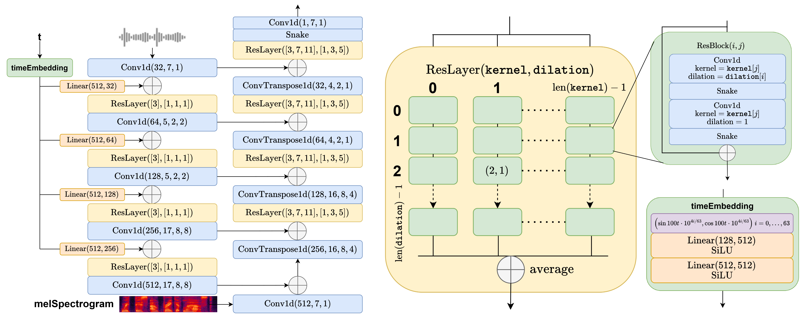

Probability flow-based models for image and audio synthesis, such as denoising diffusion probabilistic models and Poisson flow generative models, can be interpreted as modeling any ground truth distribution through the non-compressible fluid partial differential equation,  where the initial and final fluid density are the chosen prior and the ground truth distribution respectively. In this research, we analyse various previous models under the unified perspective of probability flow equation, and propose WaveODE, which is a reparameterized domain-specific rectified flow model for mel-spectrogram conditioned speech synthesis task. Since mel-spectrogram is a relatively strong condition which limits the possible audios to a small range, waveODE models the ground truth distribution with a mel-conditioned prior distribution rather than the standard Gaussian distribution, and adopts a distillation method to accelerate the inference process. Experimental results show that our model is comparable with previous vocoders in sample quality, and could generate waveforms within one step of inference.

# Model

Values in parentheses of Conv1d and ConvTranspose1d refer to (output channel, kernel width, dilation, padding). A layer takes same padding if the value for padding is omitted. In each ResBlock the channel size remains unchanged.

# Audio Samples

    

        
<h3>Model</h3>

        
<h3>Groundtruth</h3>

        
<h3>WaveODE (Ours)</h3>

        
<h3>Diffwave</h3>

        
<h3>FastDiff</h3>

        
<h3>FreGrad</h3>

        
<h3>HifiGAN</h3>

        
<h3>PriorGrad</h3>

        
<h3>WaveGlow</h3>
    
    

    

        

            
<h3>Male Speech</h3>

            
<h3>Drum</h3>

            
<h3>Song</h3>

            
<h3>Female Speech</h3>

        

        

            

                <audio controls>
                    <source src="0-Groundtruth.wav" type="audio/wav">
                    Your browser does not support the audio element.
                </audio>
            

            

                <audio controls>
                    <source src="1-Groundtruth.wav" type="audio/wav">
                    Your browser does not support the audio element.
                </audio>
            

            

                <audio controls>
                    <source src="2-Groundtruth.wav" type="audio/wav">
                    Your browser does not support the audio element.
                </audio>
            

            

                <audio controls>
                    <source src="3-Groundtruth.wav" type="audio/wav">
                    Your browser does not support the audio element.
                </audio>
            

        

        

            

                <audio controls>
                    <source src="0-WaveODE (Ours).wav" type="audio/wav">
                    Your browser does not support the audio element.
                </audio>
            

            

                <audio controls>
                    <source src="1-WaveODE (Ours).wav" type="audio/wav">
                    Your browser does not support the audio element.
                </audio>
            

            

                <audio controls>
                    <source src="2-WaveODE (Ours).wav" type="audio/wav">
                    Your browser does not support the audio element.
                </audio>
            

            

                <audio controls>
                    <source src="3-WaveODE (Ours).wav" type="audio/wav">
                    Your browser does not support the audio element.
                </audio>
            

        

        

            

                <audio controls>
                    <source src="0-Diffwave.wav" type="audio/wav">
                    Your browser does not support the audio element.
                </audio>
            

            

                <audio controls>
                    <source src="1-Diffwave.wav" type="audio/wav">
                    Your browser does not support the audio element.
                </audio>
            

            

                <audio controls>
                    <source src="2-Diffwave.wav" type="audio/wav">
                    Your browser does not support the audio element.
                </audio>
            

            

                <audio controls>
                    <source src="3-Diffwave.wav" type="audio/wav">
                    Your browser does not support the audio element.
                </audio>
            

        

        

            

                <audio controls>
                    <source src="0-FastDiff.wav" type="audio/wav">
                    Your browser does not support the audio element.
                </audio>
            

            

                <audio controls>
                    <source src="1-FastDiff.wav" type="audio/wav">
                    Your browser does not support the audio element.
                </audio>
            

            

                <audio controls>
                    <source src="2-FastDiff.wav" type="audio/wav">
                    Your browser does not support the audio element.
                </audio>
            

            

                <audio controls>
                    <source src="3-FastDiff.wav" type="audio/wav">
                    Your browser does not support the audio element.
                </audio>
            

        

        

            

                <audio controls>
                    <source src="0-FreGrad.wav" type="audio/wav">
                    Your browser does not support the audio element.
                </audio>
            

            

                <audio controls>
                    <source src="1-FreGrad.wav" type="audio/wav">
                    Your browser does not support the audio element.
                </audio>
            

            

                <audio controls>
                    <source src="2-FreGrad.wav" type="audio/wav">
                    Your browser does not support the audio element.
                </audio>
            

            

                <audio controls>
                    <source src="3-FreGrad.wav" type="audio/wav">
                    Your browser does not support the audio element.
                </audio>
            

        

        

            

                <audio controls>
                    <source src="0-HifiGAN.wav" type="audio/wav">
                    Your browser does not support the audio element.
                </audio>
            

            

                <audio controls>
                    <source src="1-HifiGAN.wav" type="audio/wav">
                    Your browser does not support the audio element.
                </audio>
            

            

                <audio controls>
                    <source src="2-HifiGAN.wav" type="audio/wav">
                    Your browser does not support the audio element.
                </audio>
            

            

                <audio controls>
                    <source src="3-HifiGAN.wav" type="audio/wav">
                    Your browser does not support the audio element.
                </audio>
            

        

        

            

                <audio controls>
                    <source src="0-PriorGrad.wav" type="audio/wav">
                    Your browser does not support the audio element.
                </audio>
            

            

                <audio controls>
                    <source src="1-PriorGrad.wav" type="audio/wav">
                    Your browser does not support the audio element.
                </audio>
            

            

                <audio controls>
                    <source src="2-PriorGrad.wav" type="audio/wav">
                    Your browser does not support the audio element.
                </audio>
            

            

                <audio controls>
                    <source src="3-PriorGrad.wav" type="audio/wav">
                    Your browser does not support the audio element.
                </audio>
            

        

        

            

                <audio controls>
                    <source src="0-WaveGlow.wav" type="audio/wav">
                    Your browser does not support the audio element.
                </audio>
            

            

                <audio controls>
                    <source src="1-WaveGlow.wav" type="audio/wav">
                    Your browser does not support the audio element.
                </audio>
            

            

                <audio controls>
                    <source src="2-WaveGlow.wav" type="audio/wav">
                    Your browser does not support the audio element.
                </audio>
            

            

                <audio controls>
                    <source src="3-WaveGlow.wav" type="audio/wav">
                    Your browser does not support the audio element.
                </audio>
            

        

    

